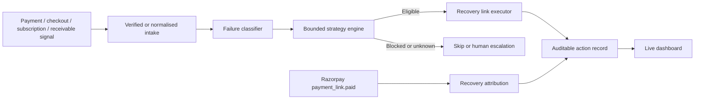

# Razorpay AI Revenue Recovery Agent — Demo Script

## One-line pitch

When revenue is at risk, the agent safely identifies the source, chooses a bounded recovery action, creates a new checkout path where appropriate, and attributes revenue only after Razorpay confirms the recovery payment.

## Start the demo

```bash
.venv\Scripts\uvicorn.exe main:app --host 127.0.0.1 --port 8000
```

Open http://127.0.0.1:8000 in a browser. In a second terminal, run:

```bash
.venv\Scripts\python.exe simulator\scenario_runner.py --scenario all --mark-recovered
```

## What to say while showing the dashboard

1. **Ingest** — “Razorpay sends us a `payment.failed` webhook. We verify it and store a redacted audit record.”
2. **Understand** — “The rules engine recognises payment degradation, checkout abandonment, subscription lifecycle risk and overdue receivables. An optional LLM only improves the merchant explanation; it never makes the payment decision.”
3. **Decide safely** — “Every action is bounded. Amounts below ₹1 are skipped, retry limits vary by failure type, and unknown cases are escalated rather than retried.”
4. **Recover** — “For eligible payment, checkout and receivables risks, we create a short-lived Razorpay payment link. Subscription risk receives a mandate-update draft, never an auto-charge. No customer messages or charges are sent automatically by this demo.”
5. **Prove outcome** — “The `payment_link.paid` webhook is the source of truth. Only then does an action move to `RECOVERED` and the Amount Recovered metric increase.”
6. **Audit** — “Click an event’s audit icon to inspect its classification, rule rationale, payment-link request, and payment confirmation.”

## Safety examples to call out

- **Below minimum**: ₹0.50 is skipped. The product avoids spending more on recovery than the transaction is worth.
- **Retry limit**: UPI timeout allows two recovery links; further attempts are blocked.
- **Duplicate delivery**: replaying the same webhook returns `duplicate`, avoiding duplicate links and duplicate customer contact.
- **Real mode**: simulator bypasses are disabled by setting `ALLOW_TEST_WEBHOOK_BYPASS=false`; real webhooks require Razorpay signature verification.
- **Checkout abandonment**: only one recovery link is created, preventing repeated chasing after a customer drops off.
- **Subscription lifecycle**: `subscription.pending` creates a mandate-update draft; the agent never auto-charges a saved mandate.
- **Overdue receivable**: `receivable.overdue` creates a collection path. A promise-to-pay pauses automated chasing; a broken promise goes to merchant collections review.

## Architecture


