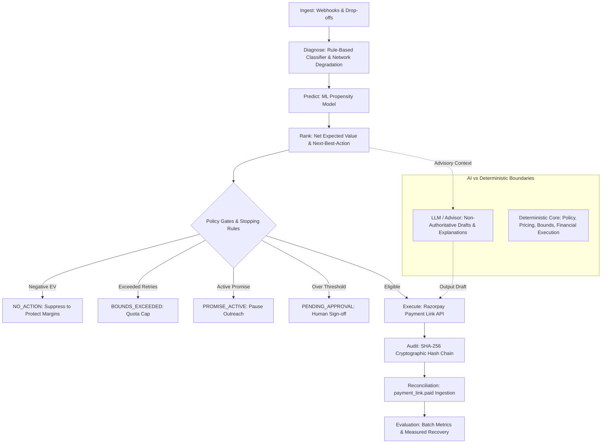

# RazorRevive — Payment Revenue Recovery Agent

A payment failure recovery system for the Razorpay ecosystem. It ingests failed payment webhooks, classifies root causes, calculates recovery propensity, evaluates net expected recovery value (EV), and executes recovery interventions via Razorpay APIs subject to deterministic safety policies and cryptographic audit trails.

---

## Architecture Overview

When a payment drops off or fails (UPI timeouts, gateway drops, card declines), RazorRevive runs a deterministic recovery pipeline:



---

## Role of AI vs. Deterministic Policy Boundaries

To satisfy compliance, auditability, and financial safety requirements, the system enforces a strict boundary between deterministic control logic and advisory AI components:

1. **Deterministic Authority**:
   - **Strategy selection, stopping rules, retry quotas, high-value approval gates, and cryptographic hashing** are executed entirely in deterministic Python code.
   - The ML model and advisory layers cannot override retry quotas, bypass approval thresholds, or trigger unauthorized API calls.

2. **Scoped Downstream Advisory (LLM)**:
   - When `OPENAI_API_KEY` is configured, an LLM drafts customer outreach copy (`agent/outreach.py`) and operator-facing explanations (`agent/advisor.py`).
   - The LLM receives scrubbed, non-PII operational context and does not access raw banking details.

3. **Static Fallbacks (Zero Configuration)**:
   - If no LLM API key is provided, the system falls back to static templates and heuristic priors without degrading core recovery logic or link generation.

---

## Core Components

### 1. Net Opportunity Scoring & Explicit `NO_ACTION`
Instead of retrying every failed payment uniformly, the engine ranks candidate strategies by **Net Opportunity Score**:

$$\text{Opportunity Score} = P(\text{Recovery}) \times \text{Amount} - \text{Intervention Cost} - \text{Friction Penalty}$$

- **Explicit `NO_ACTION`**: When all candidate actions yield negative expected value (such as sub-rupee micro-transactions or irreversible declines), the engine outputs `NO_ACTION` to avoid unnecessary messaging fees and buyer friction.
- **Cost & Friction Penalties**: Distinct cost and friction weightings are assigned to instant retries, WhatsApp payment links, alternate method suggestions, and grace period extensions.

### 2. Payment Network Degradation Detector
- Tracks a rolling window of recent transactions across payment methods (`UPI`, `CARD`, `NETBANKING`, `WALLET`).
- Flags **MODERATE** (>7% drop from baseline) and **CRITICAL** (>15% drop) network switch outages.
- Temporarily suppresses immediate retries during upstream bank outages and recommends routing users to alternative payment methods.

### 3. Decision Explainability
Every recovery decision records structured rationale:
- **Selected Action**: Net expected value breakdown and primary recovery drivers.
- **Rejected Alternatives**: Policy or mathematical reasons why other candidate strategies were disqualified.
- **Policy Constraints**: Status of retry limits, cooling periods, and customer promise-to-pay states.

### 4. High-Value Human Approval Queue
- High-ticket recovery actions exceeding the configured threshold (default: ₹5,000 / 500,000 paise) are placed into `PENDING_APPROVAL`.
- Operators can review pending actions, inspect proposed strategies, and approve or reject them with audit trail justifications.

### 5. Propensity Scoring Model
- Uses a calibrated logistic regression model trained on non-PII features (amount, failure class, payment method, retry count, time of day, merchant tier, aggregate historical success).
- Evaluated via ROC-AUC, Brier score, and a 10-decile calibration report comparing predicted probabilities against observed outcomes.

### 6. Synthetic Benchmarking & Statistical Evaluation
- Includes a 10,000-event synthetic treatment/control simulation tool (`simulator/experiment.py`).
- Computes two-proportion Z-tests, p-values, 95% Confidence Intervals, and absolute/relative lift to verify incremental recovery over natural buyer retries.

### 7. Cryptographic Audit Trail
- Each decision, state transition, and API interaction is appended to a **SHA-256 hash chain** ($H_i = \text{SHA256}(H_{i-1} \parallel \text{Step} \parallel \text{Payload})$).
- The integrity of the chain can be verified at any time via `/api/audit-trail/{action_id}/verify`.

---

## Operations Console

The web interface (`/static/dashboard.html`) provides operational visibility:
- **Recovery Funnel**: 4-stage tracking (Failed Events → Policy-Eligible → Interventions Attempted → Settled Recoveries) with drop-off counters (Retries Exceeded, Awaiting Approval, Active Promise Paused, Negative-EV Skipped).
- **Network Health**: Status cards tracking UPI, Card, Netbanking, and Wallet success rates with automated root-cause hypotheses.
- **Segment Breakdown**: Performance comparisons across Standard, Growth, and Enterprise merchant tiers.
- **Decision Inspector**: Detail view for individual events showing EV calculations, rejected alternatives, outreach drafts, and cryptographic audit steps.
- **Approvals Queue**: Review queue for high-value transactions.
- **Model Calibration View**: 10-decile predicted vs. observed calibration table with ROC-AUC and Brier metrics.
- **Scenario Testing**: Interactive trigger controls to test failure events in sandbox mode.

---

## Setup & Local Execution

### 1. Installation

**macOS / Linux:**
```bash
git clone https://github.com/modiviveks/razorpay-ai-revenue-recovery-agent.git
cd razorpay-ai-revenue-recovery-agent

python3 -m venv .venv
source .venv/bin/activate
pip install -r requirements.txt
```

**Windows (PowerShell / Command Prompt):**
```powershell
git clone https://github.com/modiviveks/razorpay-ai-revenue-recovery-agent.git
cd razorpay-ai-revenue-recovery-agent

python -m venv .venv
.venv\Scripts\Activate.ps1   # Command Prompt: .venv\Scripts\activate.bat
pip install -r requirements.txt
```

### 2. Train the Recovery Model
```bash
python -m agent.train_model
```

### 3. Start the Application Server
```bash
uvicorn main:app --reload --host 127.0.0.1 --port 8000
```
Open `http://127.0.0.1:8000/` to access the Operations Console.

### 4. Start the Background Outbox Worker (Separate Terminal)
```bash
python -m agent.worker
```

### 5. Run Scenario Simulations & Batch Evaluation
```bash
# Run 50-event batch evaluation benchmark (generates BATCH_REPORT.md)
python -m simulator.batch_eval --batch 50 --seed 42

# Trigger simulated failure scenarios via runner
python simulator/scenario_runner.py --scenario all --mark-recovered

# Run 10,000-event synthetic A/B benchmark
python -m simulator.experiment --size 10000
```

### 6. Run Test Suite
```bash
pytest -v
```

---

## Runtime Modes: Mock vs. Test Mode

Configured via `RAZORPAY_MODE` in `.env`:

### 1. Mock Mode (`RAZORPAY_MODE=mock`, Default)
- Functional out of the box with zero external dependencies.
- Simulates payment link creation, simulated checkout pages, and webhook confirmations locally.
- Intended for local development, scenario testing, and offline benchmarking.

### 2. Razorpay Test Mode (`RAZORPAY_MODE=test`)
- Communicates directly with the Razorpay API using `razorpay-python`.
- Generates real Razorpay Payment Links (`https://rzp.io/i/...`) in Razorpay's sandbox.
- Verifies `X-Razorpay-Signature` HMAC-SHA256 headers on incoming webhooks (`payment.failed`, `payment_link.paid`).
- Safety rules:
  - Live API keys (`rzp_live_...`) are rejected on startup.
  - If a test API call fails, it records an explicit `FAILED` audit record without silent fallback.

**Configuration (`.env`):**
```env
RAZORPAY_MODE=test
RAZORPAY_KEY_ID=rzp_test_YourKeyIdHere
RAZORPAY_KEY_SECRET=YourTestSecretHere
RAZORPAY_WEBHOOK_SECRET=YourWebhookSecretHere
```

---

## API Reference

| Method | Endpoint | Description |
|---|---|---|
| `GET` | `/` | Serves the Operations Console UI |
| `POST` | `/webhook/razorpay` | Ingests payment failure and `payment_link.paid` webhooks (HMAC-SHA256 verified in Test Mode) |
| `POST` | `/demo/razorpay-test/payment-link` | Triggers a recovery action generating a Razorpay Test Mode link |
| `GET` | `/api/stats` | Recovery metrics, at-risk totals, conversion rates, and runtime mode |
| `GET` | `/api/events` | Stream of recent payment failure events and agent actions |
| `GET` | `/api/analytics/funnel` | 4-stage recovery funnel and drop-off accounting |
| `GET` | `/api/analytics/segments` | Segment performance metrics (Standard, Growth, Enterprise) |
| `GET` | `/api/network/degradation-status` | Payment network health and switch latency metrics |
| `GET` | `/api/actions/pending-approvals` | High-value actions awaiting human sign-off |
| `POST` | `/api/actions/{id}/approve` | Approves a high-ticket recovery action |
| `POST` | `/api/actions/{id}/reject` | Rejects/cancels a recovery action |
| `GET` | `/api/audit-trail/{id}` | Cryptographic audit trail for an action |
| `GET` | `/api/audit-trail/{id}/verify` | Validates SHA-256 hash integrity across the audit chain |
| `GET` | `/api/model/metrics` | Model calibration metrics, ROC-AUC, Brier score, and decile table |
| `POST` | `/api/experiments/simulate` | Runs a synthetic A/B benchmark with 95% CI |
| `POST` | `/demo/simulate` | Dispatches simulated webhook failure scenarios in mock mode |
| `POST` | `/demo/batch-evaluation` | Runs automated 50-event batch evaluation benchmark with stopping rules accounting |
| `POST` | `/demo/reset` | Resets local mock state |

---

## Security & Operational Controls

1. **Deterministic Authority**: Hard boundaries (retry caps, cooling periods, human approvals, customer promises) are enforced in application code and cannot be overridden by ML or LLM components.
2. **PII Scrubbing**: Customer contact details (email, phone) are scrubbed before logging; only non-PII operational signals are retained in audit records.
3. **Outbox Reliability**: Webhooks persist events into a durable transactional outbox before processing to guarantee delivery.
4. **Non-Custodial Design**: The recovery agent only generates payment links; it never stores payment credentials or initiates unauthorized debits.

---

## License
MIT License.
